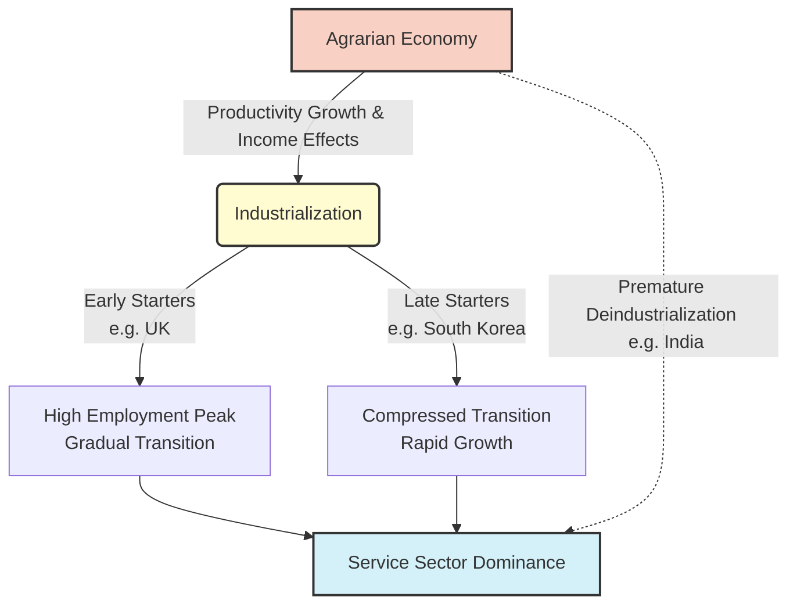
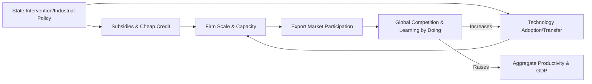
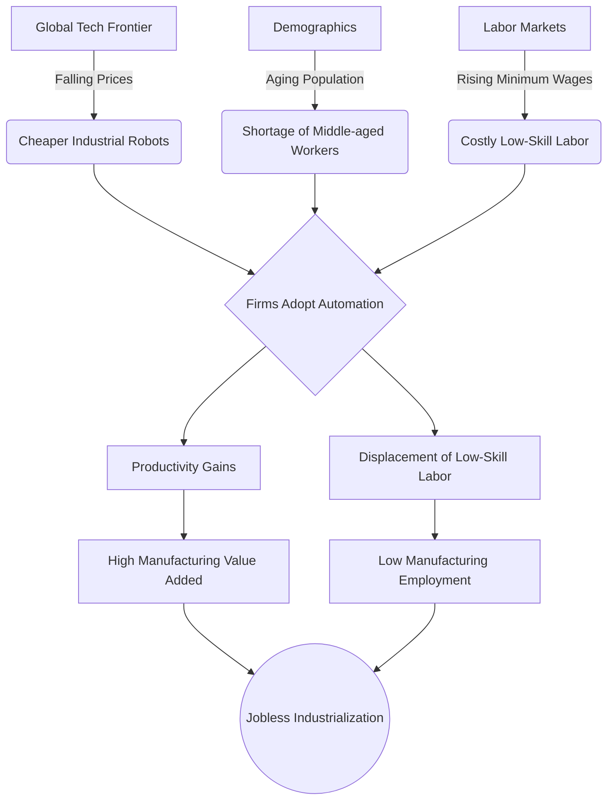

# 🏭 Industrial Development and Structural Transformation

**Tags:** #UPSC/GS3  #Economics #IndustrialPolicy #StructuralTransformation 

## 📌 Core Thesis
Industrialization has historically been the central engine for economic development, driving productivity growth and creating stable wage employment for workers with limited formal education. However, modern global conditions—automation, trade protectionism, and the rise of services—mean that traditional employment-intensive industrialization is harder to replicate today. 

## 🎯 UPSC Relevance (GS Paper 3)
* **Changes in Industrial Policy & their effects on industrial growth:** Understanding why traditional manufacturing is no longer absorbing labor in late-starter nations (like India).
* **Effects of Liberalization on the economy:** How global trade integration, automation, and global value chains dictate domestic employment.
* **Inclusive Growth:** The concept of "jobless industrialization" and its threat to demographic dividends.
# 📈 Theories of Structural Transformation

## 1. The Historical Pattern (Kuznets Facts)
Economic development is universally characterized by structural reallocation. 
* In early stages, employment and value-added shift from agriculture to industry (manufacturing, construction, mining).
* At higher income levels, services become the dominant sector. 

## 2. Mechanisms of Change
Two primary theories explain why this shift happens:
* **Income Effects (The "Food Problem"):** As incomes rise, households spend proportionally less on food and more on manufactured goods and services.
* **Baumol’s Cost Disease:** Productivity grows unevenly across sectors. Agriculture and manufacturing experience faster technological progress than services (like haircuts or live performances). Because manufacturing becomes highly efficient, it requires fewer workers to meet demand, "pushing" labor into the slower-growing service sector. 

## 3. Early vs. Late Starters
The calendar timing of industrialization dictates a country's trajectory:
* **Early Starters (e.g., Great Britain):** Experienced gradual transitions. By 1850, UK agricultural employment was below 30%. They had to innovate to push the technological frontier.
* **Late Starters (e.g., South Korea):** Benefitted from the "advantages of backwardness". By borrowing existing technologies, they compressed industrialization into a few decades.
* **The Penalty of Lateness:** While late starters grew faster, their industrial transitions were often "jobless.". Manufacturing value-added expanded much faster than manufacturing employment, meaning industry generated wealth but fewer jobs. India's trajectory suggests a potential bypass of manufacturing altogether, moving directly from agriculture to services.

# 🚢 Export-Led Growth and Industrial Policy

## 1. The Logic of Export-Led Growth
Manufacturing produces tradable goods, meaning its expansion is not constrained by the size of the domestic market. 
* A country that experiences fast productivity growth in manufacturing gains a comparative advantage, leading to higher net exports and a larger manufacturing employment share. 
* **Micro-level realities:** Only a small subset of highly productive, well-connected firms actually participate in export markets. Exporting and import competition shape technology adoption and skill formation over the long run.

## 2. The South Korean Case Study
South Korea's rapid industrialization was not purely market-driven; it was heavily shaped by active state intervention.
* **The Heavy and Chemical Industry (HCI) Drive (1970s):** The government targeted sectors like electronics, shipbuilding, and chemicals via subsidized, government-guaranteed foreign credit. 
* **Long-term impacts:** Even though the policy only lasted seven years, Korea remains a major exporter in these sectors today. It had persistent firm-level effects that lasted nearly 30 years.
* **Downsides:** Increased resource misallocation, as wealth concentrated in large plants owned by business groups (Chaebols). 

## 3. Rationales for Industrial Policy
Why should the state intervene?
* **Addressing Distortions:** Correcting sectoral misallocations or financial frictions.
* **External Economies of Scale:** Capitalizing on local productivity spillovers (Marshallian externalities) via labor pooling and knowledge diffusion.
* **Coordination Failures:** Overcoming multiple equilibria where private returns depend on the actions of other agents.

# 🐉 The Rise of China: An Industrial Perspective

## 1. Global Integration & The Dual-Track Approach
China's WTO accession in 2001 catalyzed unprecedented trade expansion. 
* **Dual-track approach:** The state preserved control over State-Owned Enterprises (SOEs) while simultaneously allowing private firms to flourish. 
* This led to resource reallocation from low-productivity state sectors to high-productivity private firms, boosting overall productivity.

## 2. Key Policy Instruments
* **Processing Trade (1978 onwards):** Firms were allowed to import inputs duty-free, assemble them domestically, and re-export. This thrived because it required little working capital in a financially friction-heavy economy.
* **Place-Based Policies (SEZs):** Special Economic Zones offered tax breaks, cheap land, and credit, which spurred investment, wage growth, and firm entry.
* **Massive Infrastructure:** The state mobilized resources to build world-class ports, highways, and railways, drastically reducing trade costs.

## 3. The Institutional Engine: "Regional Tournaments"
Chinese officials are evaluated not by voters, but by higher party authorities.
* **GDP Growth Targets:** Career advancement was tied to a "regional tournament" where local leaders competed on measurable economic outcomes.
* This incentivized officials to actively support firms, attract FDI, and build economic zones.
* **The Cost:** This short-termism led to the pursuit of growth at the expense of unmeasured externalities, such as severe environmental pollution and inequality.

# 🤖 The Future of Industrialization

## 1. Premature Deindustrialization
Coined by Dani Rodrik, this phenomenon describes how late industrializers reach their peak manufacturing employment shares at substantially lower income levels than early starters, and these peaks are inherently lower. 
* **Why?** Developing countries imported deindustrialization from advanced economies. Global trade transmitted the rapid technological progress (falling prices) of advanced manufacturing, which eroded the comparative advantage of late starters.

## 2. Automation and "Jobless Industrialization"
The diffusion of industrial robots is accelerating in emerging markets.
* **Drivers:** Falling robot prices, rising wages for low-skilled workers, and population aging. As middle-aged workers become scarce and costly, firms substitute them with robots. 
* **The Mismatch:** In developing countries, low-skilled labor is abundant and capital is scarce. Robots replace the abundant factor with the scarce one, creating a technology mismatch.

## 3. The Protectionist Threat
The export-led model is threatened by rising economic nationalism.
* In the US and UK, growing inequality has spurred calls for protectionism in import-competing areas.
* While protectionism against China creates substitution opportunities for bystander countries (like Mexico and Vietnam). overall trade policy uncertainty makes export-led strategies less predictable.

# 🛎️ Service-Led Growth

## 1. Can Services be the New Escalator?
As employment-intensive industrialization becomes harder to replicate, services are taking center stage.
* **Challenging the old view:** Services were traditionally viewed as inherently low-productivity and non-tradable.
* **The new reality:** Many services (logistics, IT, finance, business services) are now highly tradable, scalable, and exhibit productivity catch-up potential similar to manufacturing.

## 2. Production (Business) Services vs. Consumer Services
* **Production Services:** Includes ICT, consulting, and finance. High-speed internet infrastructure in Africa, for example, has promoted firm entry and productivity growth. However, these services tend to cluster in major cities and employ highly educated workers, potentially widening regional and income inequality.
* **Consumer Services:** Includes retail, tourism, and transportation. Growth here is often spurred by rising local incomes (from industrial jobs or remittances). Modern retail chains generate efficiency gains and induce productivity improvements among upstream suppliers.
## 3. Policy Implications for Developing Nations
Development strategies must treat productive services as a core component of growth, alongside manufacturing. Policymakers need to focus on upgrading the productivity of informal service activities to create stable, formal jobs.

# 📊 Visualizations for Industrial Development

## 1. The Paths of Structural Transformation (Early vs. Late Starters)

## 2. The Feedback Loop of Export-Led Industrial Policy (The Asian Miracle)

## 3. Drivers of Jobless Industrialization

