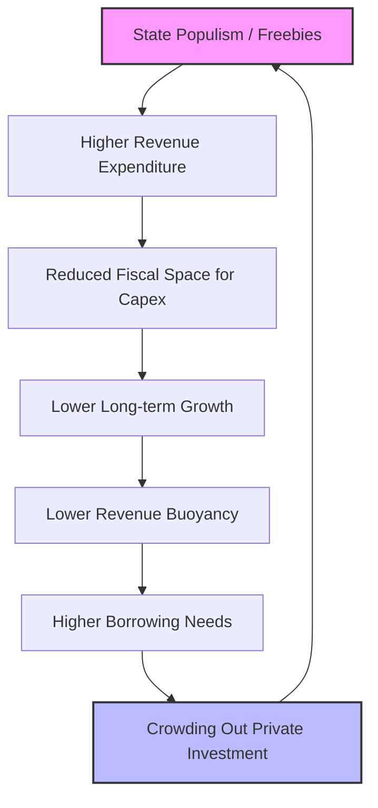

# 🏛️ The New Center of Gravity: State Finances

> [!ABSTRACT] Executive Summary
> For decades, India's fiscal health was diagnosed solely by taking the pulse of the **Union Budget**. This approach is now obsolete. The article argues that the **Centre's fiscal deficit** is no longer the sole anchor of stability. We have moved to a **"60:40 Reality"** where States control the bulk of spending but lack revenue autonomy. Consequently, **State-level fiscal choices**—borrowing, quality of spend, and transparency—now dictate India's interest rates, inflation, and long-term growth trajectory.

---

## 📊 The "60:40 Reality" (Vertical Fiscal Imbalance)

The structural asymmetry at the heart of Indian Federalism has deepened:

| Metric | Centre's Share | States' Share | Implication |
| :--- | :---: | :---: | :--- |
| **Revenue Generation** | **60%** | 40% | Centre holds the tax levers (Income Tax, GST, Customs). |
| **Expenditure Responsibility** | 40% | **60%** | States bear the burden of development (Health, Education, Law & Order). |

**The Insight:** The "Macroeconomic Frontier" has shifted because the *quality* of India's growth depends on how States spend that 60%, not just how the Centre allocates its 40%.

---

## 🔗 The Four Pillars of State-Level Impact

Subbarao outlines four critical channels through which State finances impact the national economy.

### 1. The Combined Fiscal Stance (The "Crowding Out" Effect)
* **The Mechanism:** Even if the Union FM adheres to a strict 4.4% deficit target (FY26), if States collectively breach their 3% GSDP limits, the **General Government Deficit** remains high.
* **The Consequence:**
    * **Bond Yields Spike:** States and Centre dip into the *same* pool of household savings. Higher State borrowing $\rightarrow$ Higher demand for loanable funds $\rightarrow$ Higher Yields on G-Secs.
    * **Private Capex Hit:** Corporates face higher borrowing costs, dampening the private investment cycle.
    * **Monetary Policy Blunted:** An expansionary fiscal stance by States can negate the RBI's efforts to control inflation or ease rates.

### 2. Quality of Expenditure (Growth vs. Welfare)
* **The Tension:** [[Revenue Expenditure]] (Salaries, Pensions, Subsidies) vs. [[Capital Expenditure]] (Roads, Power, Schools).
* **The Trend:** Committed expenditures are eating up fiscal space.
    * *Example:* In FY25, several states saw **pension liabilities** outpace revenue growth due to the return of the Old Pension Scheme (OPS) debates.
* **Why it matters:** States control the sectors that determine **Human Capital**:
    * 🏥 **Health:** Primary and secondary care.
    * 🏫 **Education:** School outcomes affect labor productivity.
    * ⚡ **Power:** DISCOM health determines industrial competitiveness.

### 3. Hidden Liabilities (The "Iceberg" Problem)
* **Off-Budget Borrowings:** States borrowing through Public Sector Enterprises (PSEs) or Special Purpose Vehicles (SPVs) to bypass FRBM limits.
* **The Risk:** These are *contingent liabilities*. When a State Power Corp defaults, the State Govt must pay, turning hidden debt into sovereign debt overnight.
* **16th FC Stance:** The [[16th Finance Commission]] has recommended strictly including these in debt calculations to ensure transparency.

### 4. Macro-Stability Risks (The "Greek Tragedy" Scenario)
* **Sub-national Bankruptcy:** While Indian states cannot technically go bankrupt (sovereign guarantee), fiscal stress leads to:
    * Delayed payments to MSMEs.
    * Cuts in essential capex.
    * Reliance on "Freebies" (Revadi Culture) to win elections, creating a vicious debt trap.

---

## 🧩 Detailed Linkages & Concepts

### A. The 16th Finance Commission (2026-31)
* **Context:** The Commission has just submitted its report (accepted Feb 2026).
* **New Metric:** Introduction of **"Contribution to GDP"** (10% weight) in horizontal devolution.
    * *Linkage:* This incentivizes States to grow their GSDP, aligning State self-interest with National stability.
    * *Conflict:* Southern States (Net contributors) vs. Northern States (Net recipients/Population dividend).

### B. SASCI (Special Assistance to States for Capital Investment)
* **The Carrot:** The Centre provides 50-year interest-free loans to States *conditional* on reforms (e.g., digitizing land records, power sector reforms).
* **The Outcome:** While intended to boost State Capex, recent data shows States are **slowing down** Capex execution in Q3/Q4 FY26 due to election cycles and revenue uncertainty.

### C. The Demographic Divergence
* **Youthful States (Bihar, UP):** High need for education/skilling spend.
* **Ageing States (Kerala, TN):** High need for geriatric care/pensions.
* *Macro Insight:* A "one-size-fits-all" fiscal rule (3% deficit limit) may no longer work. We need **Differential Debt Trajectories**.

---

## 🎓 UPSC Perspective (Critical Analysis)

### 📝 Mains Question Bank
**Q1 (GS-3):** "The fiscal health of Indian States is no longer a local issue but a national macroeconomic concern." Discuss this statement in light of the rising committed expenditures and off-budget borrowings. (15 Marks)
**Q2 (GS-2):** Analyze the tension between 'Welfare Populism' and 'Fiscal Prudence' in the context of Indian cooperative federalism. How does the 16th Finance Commission address this? (10 Marks)

### 🧠 Key Arguments for Answers
1.  **Arguments for State Autonomy:**
    * States are closer to the ground; "One Nation One Policy" doesn't work for diverse development stages.
    * Vertical devolution (41%) is insufficient given the 60% expenditure burden.
2.  **Arguments for Central Oversight:**
    * **Fiscal contagion:** One state's profligacy raises borrowing costs for all.
    * **Inter-generational Equity:** Borrowing for current consumption (free power) robs future generations (lack of infrastructure).

### 🔍 Prelims Pointers
* **Trends:** State Capex as % of GDP is usually lower than Revenue Ex.
* **Article 293(3):** A State cannot borrow without Centre's consent if it has outstanding loan to the Centre. (The Centre's main lever of control).
* **Off-Budget Borrowing:** Loans taken by state entities where principal/interest is serviced from the State budget.

---

## 📉 Visualizing the Debt Trap

> [!TIP] Final Thought
> India's GDP growth (7%+) is currently powered by the "Twin Engines" of Central Capex and Services Exports. For the next leg of growth, the **Third Engine**—State-level efficiency—must fire. Without this, India risks a "Middle Income Trap" fueled by sub-national fiscal drag.

## Related notes:  
- [[16th Finance Commission Report]] 
- [[Fiscal Responsibility and Budget Management (FRBM) Act]] 
- [[Capital Expenditure (Capex) Trends]] 
- [[Vertical Fiscal Imbalance]]